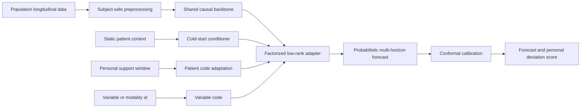

# CDHAI-HAPF

CDHAI-HAPF is a research prototype for a Hierarchical Adaptive Patient
Forecaster. It studies a specific question: can a shared physiological
forecasting model be adapted to an individual patient with a small, regularized
parameter budget while preserving a safe population fallback?

The first task is probabilistic 30- and 60-minute glucose forecasting. The
architecture is designed to extend to other longitudinal variables, but this
repository does not claim disease diagnosis or clinical readiness.

## Core Idea

A population model learns dynamics that are shared across patients. A compact
patient code then controls a low-rank residual adapter. A variable code controls
which part of that low-rank space is active for a measurement channel. The
result is a factorized patient-by-variable update instead of a complete model
copy for every patient and variable.

For layer `l`, patient `i`, and variable `v`:

```text
h_(l+1) = F_l(h_l; W_l) + U_l diag(a_(i,l) * b_(v,l)) V_l h_l
```

`W_l`, `U_l`, and `V_l` are shared. `a_i` is a small patient code and `b_v` is
a variable code. Patient adaptation updates only `a_i` and an optional output
bias. L2 shrinkage and early stopping pull weakly supported patients back
toward the population model.

This is related to LoRA, but it is not a literal copy of language-model LoRA.
The low-rank update is conditioned on patient and variable identity, and its
strength can collapse to zero when personal data are insufficient.

## System Design



The intended full model has four levels:

1. Population foundation: causal self-supervised and supervised pretraining.
2. Cohort or device calibration: optional adapter for source-domain shift.
3. Patient adaptation: a low-dimensional code with hierarchical shrinkage.
4. Variable adaptation: modality-specific input and output factors, shared
   across patients.

The current executable prototype implements a compact causal TCN backbone,
patient-conditioned low-rank adapter, probabilistic two-horizon head, and
chronological conformal calibration.

## Why Not One Model Per Patient?

Independent patient models waste shared information and are unstable for new
patients. A single population model can underfit meaningful heterogeneity. HAPF
is a partial-pooling model: it shares most parameters but permits bounded,
auditable deviations where personal evidence supports them.

## Current Sample Scope

The initial A-User-Store sample contains 15 unique subjects, 12 subjects with
CGM, about 138,802 CGM observations, and partially observed diet, exercise, and
medication events. Birth year, gender, disease type, height, and weight are
partially available. Race and genomic variables are not present.

This sample is useful for pipeline and personalization experiments. It is not
large enough to train a general medical foundation model or to establish that
demographic or genetic conditioning improves outcomes. See
[`docs/sample_data_audit.md`](docs/sample_data_audit.md).

## Leakage Rule

All outer train/test splits use `subject_key`, not `PatientID`. The supplied
sample can contain more than one `PatientID` for the same person. A PatientID
split would leak the same human into both population training and held-out
evaluation.

For a held-out subject, time is divided in order:

```text
support/adaptation -> calibration -> test
```

No future observation may influence a feature, normalization statistic,
adapter update, stopping decision, or prediction interval.

## Evaluation Ladder

Every personalized result must be compared with:

- Last-value persistence.
- Population model with no patient adaptation.
- Population model plus static covariates.
- Last-layer or output-bias tuning.
- Full fine-tuning with strong regularization.
- HAPF patient-code adaptation.
- Subject-only model when enough data exist.

Primary metrics are MAE and RMSE by horizon. Glucose experiments also report
clinical error-grid summaries when valid reference pairs are available,
interval coverage and width, patient-level improvement distributions, and
failure cases. Aggregate row-level significance is not accepted as evidence;
the patient is the unit of evaluation.

## Quick Start

```powershell
python -m venv .venv
.venv\Scripts\Activate.ps1
python -m pip install -e ".[dev,plots]"
python -m pytest
```

Run the local A-User-Store proof of concept without copying patient data into
this repository:

```powershell
python scripts/run_sample_experiment.py `
  --data "D:\data\code\github\CDHAI\CDHAI_June\reports\a_user_store_composite\latest\record_CGM5Min.parquet" `
  --output runs/sample
```

Run exploratory leave-one-subject-out evaluation:

```powershell
python scripts/run_cross_validation.py `
  --data "D:\data\code\github\CDHAI\CDHAI_June\reports\a_user_store_composite\latest\record_CGM5Min.parquet" `
  --output runs/cross_validation
```

Generated runs, checkpoints, CSV files, and patient data are gitignored.

## Repository Structure

```text
configs/                  Experiment configuration
docs/                     Architecture, protocol, audit, literature, governance
scripts/                  Reproducible experiment entry points
src/hapf/data/            Subject-safe CGM window construction
src/hapf/models/          Causal backbone and low-rank adapters
src/hapf/training/        Population training and patient adaptation
src/hapf/evaluation/      Forecast and calibration metrics
tests/                    Shape, leakage, adaptation, and smoke tests
```

## Research Status

This repository is preclinical research software. It must not be used for
diagnosis, insulin dosing, treatment selection, or patient-facing alerts. The
model and its references support research hypotheses, not clinical claims.

Detailed design and assumptions:

- [`docs/architecture.md`](docs/architecture.md)
- [`docs/research_protocol.md`](docs/research_protocol.md)
- [`docs/literature_review.md`](docs/literature_review.md)
- [`docs/data_governance.md`](docs/data_governance.md)
- [`docs/proof_of_concept.md`](docs/proof_of_concept.md)
